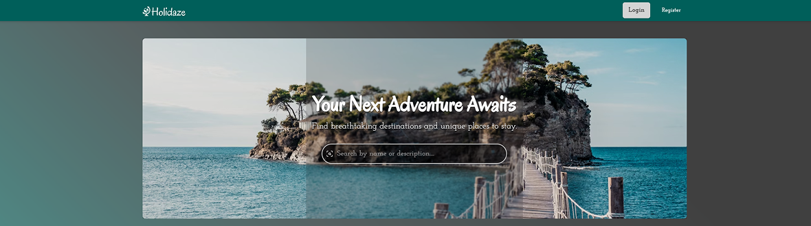
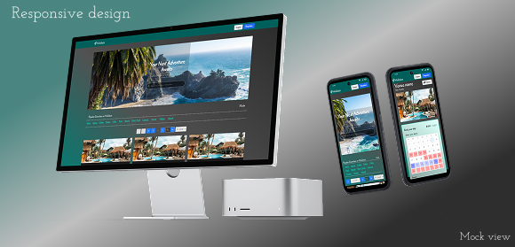
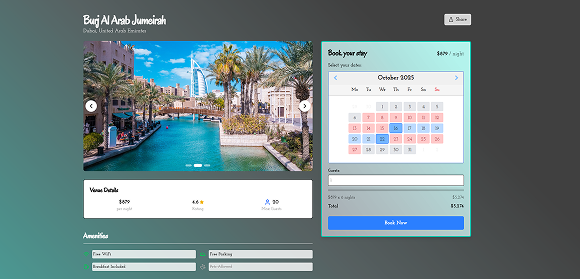
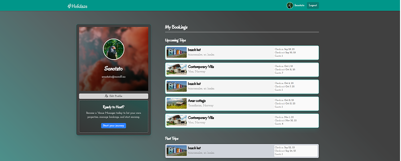
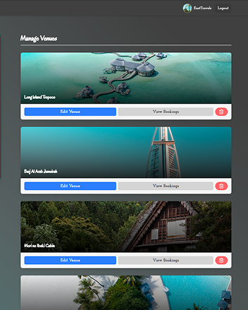

# Holidaze Project

## 📸 Screenshots & Mockups

<div id="top" style="display: flex; flex-wrap: wrap; gap: 10px;">
  
  
  
  
   
</div>

### 🌐 Visit the live site: [Holidaze website](https://tom-holidaze.netlify.app/)

# Holidaze

## 📌 About the Project

Holidaze is a booking website designed for both customers and venue managers. Visitors can browse and search for venues, check availability, and decide whether to register and make a booking.

**Visitors**

- Can browse and search venues by title or description.
- Can view venue details without registering.
- Cannot make bookings without registration.

**Customers**

- Have all visitor privileges.
- Access a personal dashboard showing their bookings.
- Can track upcoming and past bookings.

**Venue Managers**

- Have all customer privileges.
- Can create, edit, and delete venues they manage.
- Can book any venue, including their own.

### Key Features

- User registration and authentication system
- Browse and search venues with filtering
- Customer dashboard for managing bookings
- Venue manager dashboard for managing venues
- Create, edit, and delete venues (Venue Manager only)
- View availability and make bookings

### 🎯 My Plan

- Implement responsive design for mobile and desktop
- Add booking confirmation emails/notifications
- Include advanced search and filtering options
- Improve UI with animations and visual feedback
- Implement admin panel for site-wide management

---

<p  align="right"><a href="#top">⬆️ Back to Top</a></p>

## 🚀 Getting Started

### 🔹 Clone or Download

To get a copy of this project, you can **clone** or **fork** the repository:

```bash
git clone https://github.com/tomive01888/holidaze
```

Alternatively, download the ZIP file and extract it.

### 🔹 Install Dependencies

```bash
npm install
```

**Installed dependencies:**

<details style="margin-bottom: 10px">
  <summary style="color:teal; user-select: none; cursor: pointer;"><strong>Click to view dependencies</strong></summary>

- **React** – Frontend library for building UI
- **React DOM** – React rendering for web
- **React Router DOM** – Client-side routing
- **Tailwind CSS** – Utility-first CSS framework
- **@tailwindcss/vite** – Tailwind integration for Vite
- **Vite** – Build tool and development server
- **Lucide React** – Icon library for React
- **React Datepicker** – Date picking component
- **React Toastify** – Toast notifications
- **DOMPurify** – Sanitize HTML to prevent XSS
- **TypeScript** – Typed JavaScript
- **ESLint** – Linting for clean code

</details>

### 🔹 Run the Development Server

```bash
npm run dev
```

<p  align="right"><a href="#top">⬆️ Back to Top</a></p>

---

## 🔑 Environment Variables

This project requires an **API key** for restricted actions.

1. Get your API key from [Noroff API Key Tool](https://docs.noroff.dev/docs/v2/auth/api-key#api-key-tool).
2. Create a `.env` file in the root directory.
3. Add the following line:

```bash
VITE_API_KEY=<your_api_key>
```

Replace `<your_api_key>` with the actual API key.

4. Add `.env` in `.gitignore` to stop it from being pushed publicly.

---

<p  align="right"><a href="#top">⬆️ Back to Top</a></p>

## API Reference

This project interacts with the **Noroff Holidaze API**, which provides endpoints for holidaze venues, booking and make venues.  
For detailed documentation, visit: [Noroff Holidaze API](https://docs.noroff.dev/docs/v2/holidaze/venues#all-venues).

### Base URL:

```
https://api.noroff.dev/api/v2
```

⚠️ Some of the endpoints requires authenticated keys to use.
Read more in the link above about which requires authentication and more on url parameters.

---

## Project and design planning

- [Kanban holidaze](https://github.com/users/tomive01888/projects/11/views/2)
- [Figma project holidaze](https://www.figma.com/design/Md8qmtG2FMgwvo1laUyAEX/Holidaze_projectExam2?node-id=0-1&t=gufZ72GY3tznweza-1)

---

## 🛠 Built With

<div style="display: flex; gap: 10px;">
  <a href="https://www.figma.com/">
    
  </a>  
  <a href="https://react.dev/">
    
  </a>  
  <a href="https://tailwindcss.com/">
    
  </a>  
  <a href="https://developer.mozilla.org/en-US/docs/Glossary/TypeScript">
    
  </a>  
  <a href="https://vite.dev/">
    
  </a>
</div>

---

## Resources

- **Noroff Holidaze API** – Used for fetching venues, bookings and user management  
- **Figma** – For UI/UX mockups and design planning  
- **AI Assistance** – Coding support and logic ideas, verify code structure, suggest optimizations and ensure accessibility compliance (WCAG).
- **Tailwind CSS Docs** – Reference for styling and utilities  
- **React Docs** – Reference for component structure and hooks 

---

## 📩 Contact

🔗 **GitHub:** [tomive01888](https://github.com/tomive01888)

---

<p  align="right"><a href="#top">⬆️ Back to Top</a></p>
